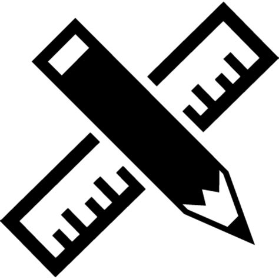

# AR-Ruler

## Goal

The objective of this app is to learn more about AR kit.

## What I created

I created a ruler that works with AR to measure any object around you with the tap of a finger. No longer do you need to lug a cumbersome tape measure around when AR Ruler is in town.

## What I Learned

* How to detect the start point of a measurement (by a tap)
* Calculating the distance between two 3D points
* How to create 3D text in the AR Scene
* Resetting Measurements

>This is a companion project to The App Brewery's Complete App Development Bootcamp, check out the full course at [www.appbrewery.co](https://www.appbrewery.co/)

